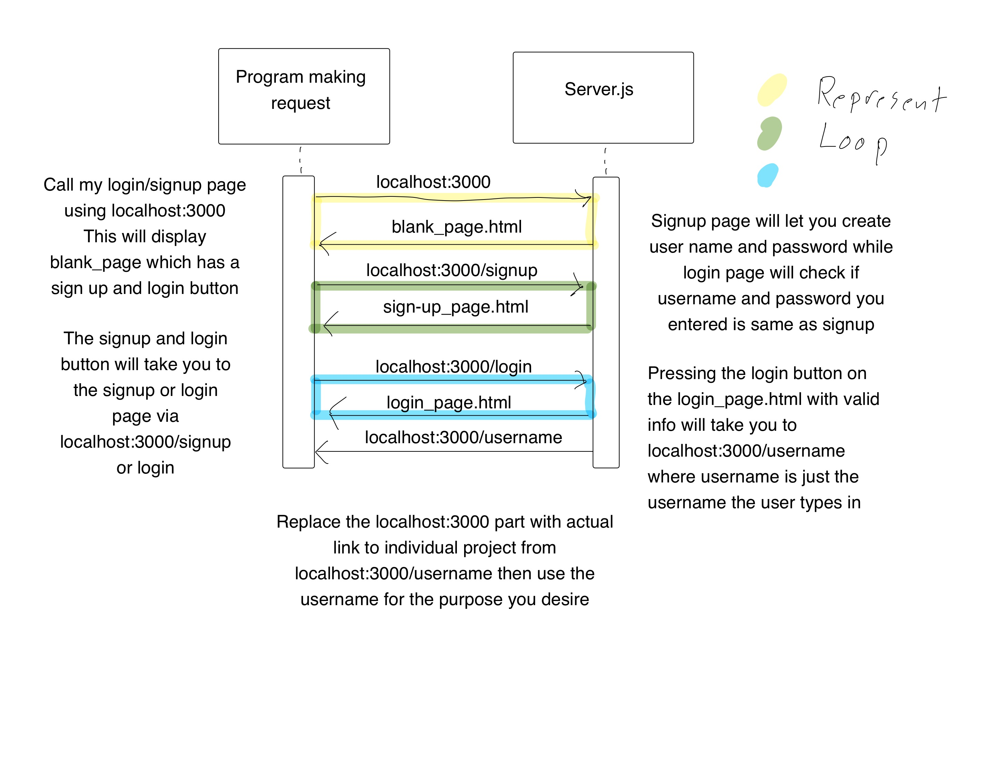

For request: Enter the link localhost:3000 into your browser and it will take you to the main html page where you can signup and login using the two buttons on the page this will redirect you to either localhost:3000/signup or localhost:3000/login.

For response: After entering a valid login info the microservice will provide you the link localhost3000:/username where username is the name enetered by the user.

Make sure to start the server using node server.js and have Express downloaded then you can call my microservice using localhost:3000 and after you login it will redirect you to localhost:3000/username, replace the localhost:3000 with the link to your individual project, but it will still send the data of the username over and you can use it for any purpose you want.

